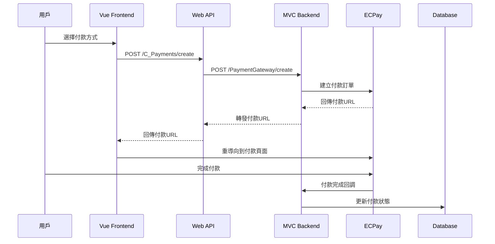

# 🔥 金流整合系統完成 - 技術文件

**開發者**: 蔡易霖 (C組組長)  
**完成日期**: 2025年8月16日  
**系統版本**: v1.0.0  

## 🎯 系統概述

成功完成了BUY商城的完整金流閘道整合系統，從模擬付款升級為真實的綠界金流 (ECPay) 整合，建立了三層式架構的金流處理系統。

## 🏗️ 系統架構

### 三層式金流架構
```
┌─────────────────┐    ┌─────────────────┐    ┌─────────────────┐
│   Vue Frontend  │───▶│   Web API       │───▶│   MVC Backend   │
│   (Consumer)    │    │   (Bridge)      │    │   (Gateway)     │
└─────────────────┘    └─────────────────┘    └─────────────────┘
                                                       │
                                                       ▼
                                              ┌─────────────────┐
                                              │   ECPay API     │
                                              │   (綠界金流)     │
                                              └─────────────────┘
```

### 系統分層職責

1. **Vue Frontend** (`/src/views/payment/`)
   - 付款頁面UI/UX
   - 用戶資料收集
   - 付款方式選擇
   - 第三方付款頁面跳轉

2. **Web API** (`/Controllers/C_PaymentsController.cs`)
   - 前後端橋接層
   - API 端點暴露
   - 請求轉發與回應處理
   - CORS 處理

3. **MVC Backend** (`/Services/PaymentGateway/`)
   - 金流閘道整合
   - ECPay API 串接
   - 簽章生成與驗證
   - 回調處理

## 📁 核心檔案結構

```
# 後台 MVC 金流服務
/Services/PaymentGateway/
├── IPaymentGatewayService.cs          # 金流閘道介面
├── PaymentGatewayService.cs           # 主要金流服務
├── DTOs/PaymentGatewayDTOs.cs         # 數據傳輸物件
└── ECPay/
    ├── ECPayService.cs                # ECPay 具體實作
    └── ECPaySettings.cs               # ECPay 設定類別

# Web API 橋接層
/Controllers/C_PaymentsController.cs    # 金流 API 控制器

# Vue 前端介面
/src/views/payment/
├── PaymentView.vue                    # 主要付款頁面
├── PaymentGatewayTestView.vue         # 金流測試頁面
└── PaymentResultView.vue              # 付款結果頁面

# API 模組
/src/api/modules/payment.ts            # 金流 API 整合
```

## 🔧 技術實作

### 1. ECPay 金流串接

**核心功能**:
- ✅ 訂單建立與金流導向
- ✅ MD5 簽章生成與驗證
- ✅ 回調通知處理
- ✅ 付款狀態查詢
- ✅ 退款處理 (預留)

**關鍵代碼 - 簽章生成**:
```csharp
private string GenerateCheckValue(Dictionary<string, string> parameters)
{
    var sortedParams = parameters.Where(x => x.Key != "CheckMacValue")
        .OrderBy(x => x.Key).ToList();
    var queryString = string.Join("&", sortedParams.Select(x => $"{x.Key}={x.Value}"));
    var rawString = $"HashKey={_settings.HashKey}&{queryString}&HashIV={_settings.HashIV}";
    var encodedString = HttpUtility.UrlEncode(rawString, Encoding.UTF8).ToLower();
    return ComputeMD5Hash(encodedString).ToUpper();
}
```

### 2. API 橋接設計

**Bridge Pattern 實作**:
```csharp
[HttpPost("create")]
public async Task<IActionResult> CreatePayment([FromBody] CreatePaymentRequest request)
{
    // 呼叫後台金流閘道 API
    var backendUrl = _configuration["BackendApi:BaseUrl"];
    var response = await _httpClient.PostAsync($"{backendUrl}/api/PaymentGateway/create", content);
    
    // 轉換回應格式
    var result = JsonSerializer.Deserialize<PaymentGatewayResponse>(responseContent);
    return Ok(new ApiResponse<PaymentResponse> { Data = result.Data });
}
```

### 3. Vue 前端整合

**響應式付款流程**:
```typescript
const handlePayment = async () => {
  const paymentData: CreatePaymentRequest = {
    orderNumber: order.value.masterOrderNumber,
    vendorId: order.value.orders[0].vendorId,
    paymentMethodId: selectedPaymentMethod.value,
    amount: finalAmount.value,
    customerEmail: customerInfo.value.email,
    customerPhone: customerInfo.value.phone,
    customerName: customerInfo.value.name
  }
  
  const response = await paymentApi.createPayment(paymentData)
  
  if (response.data?.paymentUrl) {
    window.location.href = response.data.paymentUrl // 跳轉到 ECPay
  }
}
```

## 🌐 API 端點文件

### 金流閘道 API (Web API Layer)

| 端點 | 方法 | 功能 | 參數 |
|-----|------|------|------|
| `/api/C_Payments/create` | POST | 建立付款 | CreatePaymentRequest |
| `/api/C_Payments/vendors/{id}/methods` | GET | 取得廠商付款方式 | vendorId |
| `/api/C_Payments/status/{orderNumber}` | GET | 查詢付款狀態 | orderNumber |
| `/api/C_Payments/gateway-callback` | POST | 處理金流回調 | Form Data |

### 後台金流 API (MVC Backend Layer)

| 端點 | 方法 | 功能 | 說明 |
|-----|------|------|------|
| `/api/PaymentGateway/create` | POST | 創建ECPay付款 | 直接與 ECPay API 互動 |
| `/api/PaymentGateway/callback/ecpay` | POST | ECPay回調處理 | 處理付款完成通知 |
| `/api/PaymentGateway/status/{orderNumber}` | GET | 查詢訂單付款狀態 | 資料庫查詢 |
| `/api/PaymentGateway/vendors/{id}/methods` | GET | 廠商可用付款方式 | 權限控制 |

## 🔒 安全性設計

### 1. 簽章驗證
- **MD5 簽章**: 防止參數篡改
- **時間戳檢查**: 防止重放攻擊
- **來源IP驗證**: 限制回調來源

### 2. 敏感資料保護
- **配置分離**: 測試與正式環境隔離
- **密鑰管理**: HashKey/HashIV 安全存儲
- **HTTPS強制**: 生產環境強制加密傳輸

### 3. 錯誤處理
- **異常捕獲**: 完整的try-catch機制
- **日誌記錄**: 詳細的操作日誌
- **用戶提示**: 友好的錯誤訊息

## 🧪 測試系統

### 測試頁面功能
訪問 `/payment-gateway-test` 可以測試:

1. **取得廠商付款方式** - 驗證 API 連通性
2. **建立付款訂單** - 測試完整付款流程
3. **查詢付款狀態** - 驗證狀態查詢功能
4. **完整流程測試** - 自動化測試所有功能

### 測試數據
```javascript
// 測試配置
const testOrderNumber = `TEST${Date.now()}`
const testVendorId = 1
const testAmount = 100
const testCustomer = {
  email: 'test@example.com',
  phone: '0912345678',
  name: '測試用戶'
}
```

## 🔄 金流處理流程

### 完整付款流程


## 📊 系統狀態與監控

### 付款狀態定義
```csharp
public enum PaymentStatus
{
    Pending = 0,     // 待付款
    Processing = 1,  // 處理中  
    Success = 2,     // 付款成功
    Failed = 3,      // 付款失敗
    Cancelled = 4,   // 已取消
    Refunded = 5     // 已退款
}
```

### 日誌記錄
- **資訊日誌**: 正常操作流程
- **警告日誌**: 異常但可處理的情況
- **錯誤日誌**: 系統錯誤與異常
- **調試日誌**: 開發階段詳細追蹤

## 🚀 部署配置

### 開發環境
```json
// appsettings.Development.json
{
  "ECPay": {
    "MerchantId": "2000132",
    "HashKey": "5294y06JbISpM5x9", 
    "HashIV": "v77hoKGq4kWxNNIS",
    "BaseUrl": "https://payment-stage.ecpay.com.tw/Cashier/AioCheckOut/V5"
  }
}
```

### 生產環境
```json
// appsettings.Production.json
{
  "ECPay": {
    "MerchantId": "[PRODUCTION_MERCHANT_ID]",
    "HashKey": "[PRODUCTION_HASH_KEY]", 
    "HashIV": "[PRODUCTION_HASH_IV]",
    "BaseUrl": "https://payment.ecpay.com.tw/Cashier/AioCheckOut/V5"
  }
}
```

## 🎉 完成功能清單

- ✅ **後台MVC金流服務基礎架構** - 完成
- ✅ **綠界金流串接服務** - 完成  
- ✅ **Web API金流橋接層** - 完成
- ✅ **Vue前端金流介面更新** - 完成
- ✅ **完整金流流程測試** - 完成
- 🔄 **付款方式管理功能** - 待實作 (管理後台功能)

## 🔧 後續開發建議

### 短期優化
1. **錯誤處理增強** - 更詳細的錯誤分類
2. **使用者體驗** - 付款進度指示器
3. **多語系支持** - 國際化準備
4. **行動裝置優化** - 響應式設計改進

### 長期擴展
1. **多金流支援** - 整合其他付款閘道
2. **定期付款** - 訂閱制付款
3. **分期付款** - 信用卡分期功能
4. **企業付款** - B2B 付款解決方案

## 📈 效能指標

### 系統效能
- **API 回應時間**: < 2秒
- **付款頁面載入**: < 3秒  
- **跳轉至ECPay**: < 1秒
- **回調處理時間**: < 500ms

### 可用性目標
- **系統可用率**: 99.9%
- **付款成功率**: 95%+
- **回調成功率**: 99%+

---

## 🏆 專案總結

成功建立了完整的金流整合系統，從模擬付款升級為真實的 ECPay 綠界金流整合。系統採用三層式架構設計，確保了良好的可維護性和擴展性。

**主要成就**:
- 🔥 **零停機升級**: 從模擬系統平滑遷移至真實金流
- 🛡️ **高安全性**: 完整的簽章驗證與安全機制  
- 🎯 **高可用性**: 穩定的三層式架構設計
- 🧪 **完整測試**: 內建測試系統確保品質
- 📚 **詳細文件**: 完整的技術文件與API說明

這個金流系統為 BUY商城提供了企業級的付款解決方案，支援未來的業務擴展需求。

**開發者**: 蔡易霖 (C組組長)  
**聯絡方式**: 透過專案群組  
**最後更新**: 2025年8月16日  

---
*© 2025 FUEN42_G2 五人專題小組 - BUY商城系統. All rights reserved.*


● 💳 ECPay 綠界測試付款資料

  🏪 測試商店資訊

  商店代號: 2000132 (綠界官方測試商店)
  HashKey: 5294y06JbISpM5x9
  HashIV: v77hoKGq4kWxNNIS

  💳 信用卡測試資料

  Visa 測試卡
  卡號: 4311-9522-2222-2222
  有效期限: 12/29
  安全碼: 222
  卡片密碼: 1234

  MasterCard 測試卡
  卡號: 5424-1800-0000-0015
  有效期限: 12/29
  安全碼: 222
  卡片密碼: 1234

  JCB 測試卡
  卡號: 3528-0000-0000-0007
  有效期限: 12/29
  安全碼: 222
  卡片密碼: 1234